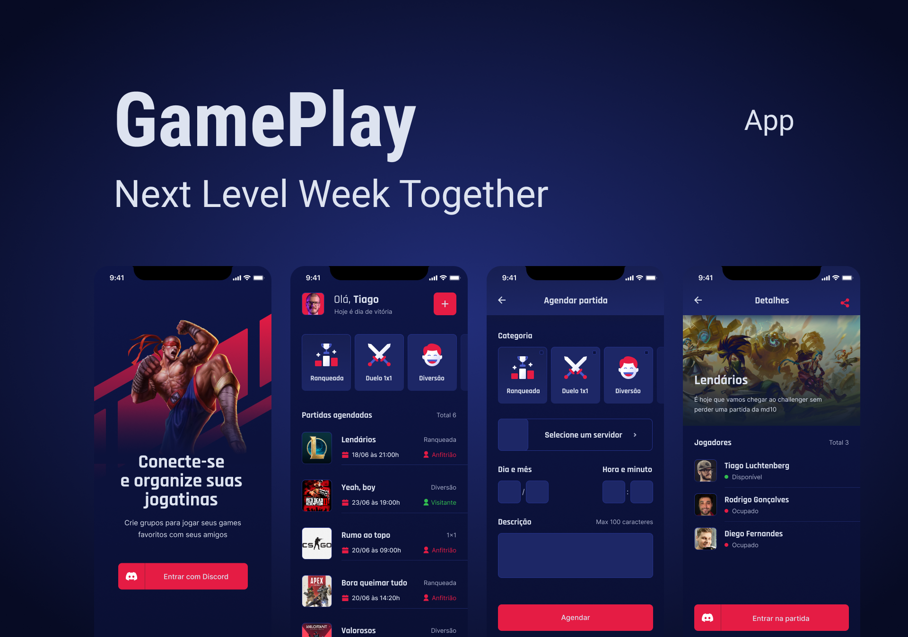

# Gameplay

<!---Esses são exemplos. Veja https://shields.io para outras pessoas ou para personalizar este conjunto de escudos. Você pode querer incluir dependências, status do projeto e informações de licença aqui--->




> Um aplicativo com a função de marcar partidas com os amigos através dos servidores do Discord.
### Ajustes e melhorias

O projeto ainda está em desenvolvimento e as próximas atualizações serão voltadas nas seguintes tarefas:

- [ ] Adicionar modal para logout da aplicação

## 💻 Pré-requisitos

Antes de começar, verifique se você atendeu aos seguintes requisitos:
<!---Estes são apenas requisitos de exemplo. Adicionar, duplicar ou remover conforme necessário--->
* Você instalou a versão mais recente de `<linguagem / dependência / requeridos>`
* Você tem uma máquina `<Windows / Linux / Mac>`. Indique qual sistema operacional é compatível / não compatível.

## 🚀 Instalando o Gameplay

Para instalar o Gameplay, siga estas etapas:

Linux e macOS:
```
git clone https://github.com/pedrocmoreira/gameplay
cd gameplay
yarn install
npx expo start 
```

Windows:
```
git clone https://github.com/pedrocmoreira/gameplay
cd gameplay
yarn install
npx expo start 
```

## ☕ Usando o Gameplay

Para usar o Gameplay, siga estas etapas:

- Estar logado com o expo no terminal da sua máquina
- Ter as credenciais de desenvolvdor do Discord
- Configurar as credenciais de desenvolvedor do discord no arquivo .env.example

## 📫 Contribuindo para Gameplay
Para contribuir com Gameplay, siga estas etapas:

1. Bifurque este repositório.
2. Crie um branch: `git checkout -b <nome_branch>`.
3. Faça suas alterações e confirme-as: `git commit -m '<mensagem_commit>'`
4. Envie para o branch original: `git push origin <nome_branch> / <local>`
5. Crie a solicitação de pull.

Como alternativa, consulte a documentação do GitHub em [como criar uma solicitação pull](https://help.github.com/en/github/collaborating-with-issues-and-pull-requests/creating-a-pull-request).

## 🤝 Colaboradores

Agradecemos às seguintes pessoas que contribuíram para este projeto:

<table>
  <tr>
    <td align="center">
      <a href="#">
        <br>
        <sub>
          <b>Pedro Moreira</b>
        </sub>
      </a>
    </td>
  </tr>
</table>

[⬆ Voltar ao topo](#gameplay)<br>
